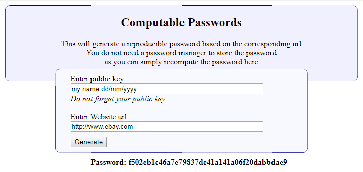

# ComputablePasswords.Web

This program generates a reproducible password based on the corresponding url
This means you will not be required to store any passwords but just regenerate
the password based on the url for the website.

The Crypto type used is dependant on the existance of a file with the name of the crypto type.
Therefore, a file can either have the name sha1 or sha256 and that crypto type will be used.

The pepper is generated from the contents of the first line of a file called public.key. 

Because the salt needs to be unique for each hash, it is based on the url.

